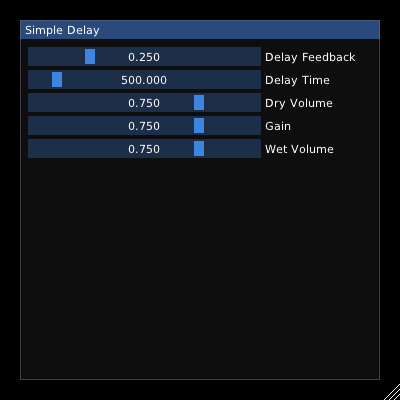
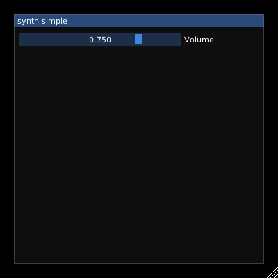

# Heavy Examples for DPF
---
This repository contains Heavy compatible Pure Data patches that can be used with the Distrho Plugin Framework (DPF) generator.

There are builds for at least LV2, VST2, VST3, and CLAP on all major Operating Systems. Linux, Windows and MacOS. A GUI with basic widgets is generated as well.

DSSI and LADSPA plugins can be enabled manually if needed

## Simple Delay

## Simple Synth

