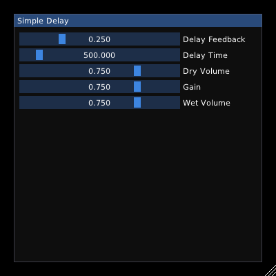
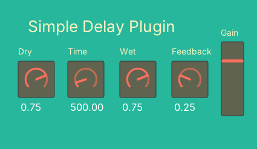
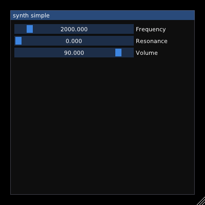
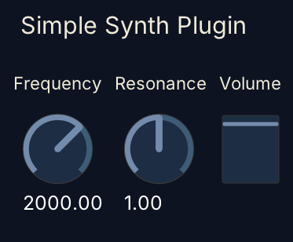

# Heavy Examples for DPF
---
This repository contains Heavy compatible Pure Data patches that can be used with the Distrho Plugin Framework (DPF) generator.

There are builds for at least LV2, VST2, VST3, and CLAP on all major Operating Systems. Linux, Windows and MacOS.

There are two versions, one with a Dear ImGui UI using basic widgets and one using NanoVG with a converted [plugdata](https://plugdata.org/) UI.

DSSI and LADSPA plugins can be enabled manually if needed

## Simple Delay

Dear ImGui generated:

NanoVG converted:

## Simple Synth

Dear ImGui generated:

NanoVG converted:

